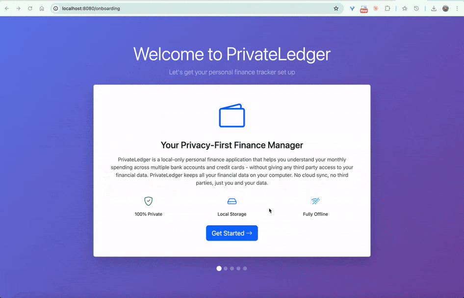
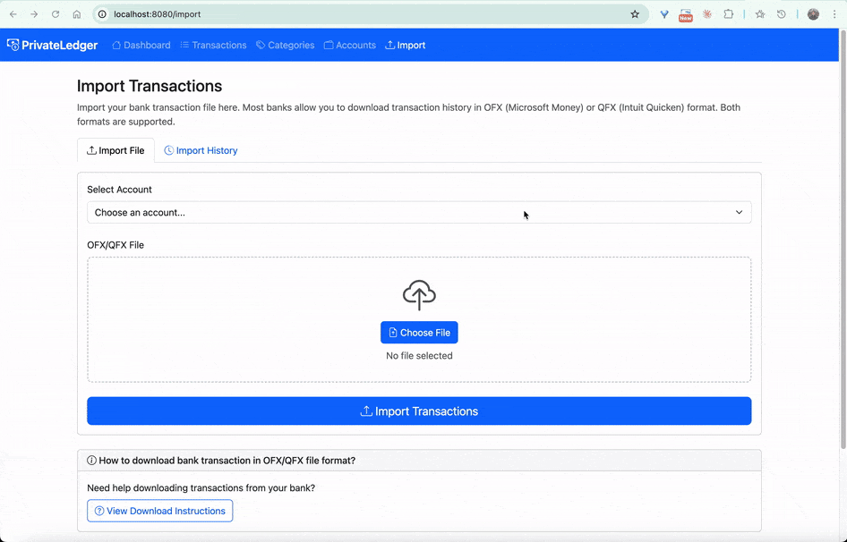
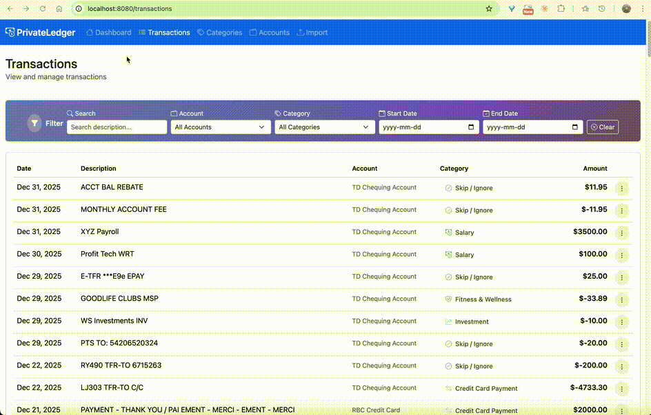

# PrivateLedger

**Privacy-First Personal Expense Tracker**

PrivateLedger is a **local-only personal finance application** that helps you understand your monthly spending across multiple bank accounts and credit cards—**without giving any third-party access to your financial data**.

Many personal finance apps require direct access to your bank accounts or uploading statements to external servers. For privacy-conscious users, this creates an uncomfortable trade-off between convenience and control. PrivateLedger takes a different approach.

Instead of connecting to your bank, PrivateLedger works entirely with **transaction files you download yourself**. Most banks in the **US, Canada, and the UK** allow exporting transaction history in **OFX (Microsoft Money)** or **QFX (Intuit Quicken)** formats. PrivateLedger imports these files locally, consolidates transactions across accounts, and generates meaningful spending insights—while keeping **all data on your own machine**.

No cloud.  
No bank credentials.  
No data leaving your system.

PrivateLedger is designed for users who want **full ownership of their financial data**, transparency in how categorization works, and the flexibility to extend or audit the code themselves.

---

## Screenshots

### Onboarding


### Import and Transactions Management


### Dashboard and Monthly Breakdown



---

## Features

- **Privacy-First by Design**  
  All data stays local. No cloud storage, no APIs, no telemetry.

- **OFX / QFX Import**  
  Seamlessly import transaction history from multiple banks and credit card providers using standard OFX/QFX files, which are supported by the majority of banks in the US, Canada, and the UK.

- **Multi-Account Consolidation**  
  Combine transactions from multiple chequing accounts, savings accounts, and credit cards.

- **Smart Categorization**  
  Automatically categorizes transactions using pattern-based logic, with the flexibility for manual overrides and custom rules.

- **Insights Dashboard**  
  Monthly spending breakdowns, category trends, and expenditure analysis.

- **Local Web Application**  
  Runs entirely on your machine via a local web UI.

- **Simple Distribution**
  Single binary, no external dependencies, no installation hassles.

## Smart, Category-Based Financial Model

PrivateLedger is built around a flexible **category system** that reflects how people actually think about money.

### Smart Categorization
- Comes with sensible default categories (e.g., Groceries & Household, Shopping & Retail, Housing)
- You can rename categories or create your own
- Categories support **keyword-based patterns** (e.g., `COSTCO`, `AMAZON`, `NETFLIX`)
- Transactions are categorized automatically using these patterns
- You can manually reassign any transaction at any time
- New patterns can be applied to past and future matching transactions

As you refine patterns over time, categorization becomes increasingly automatic and accurate.

### Category Types
Every category belongs to one of four types, which determines how it affects insights and reports:

- **Expense**  
  Everyday spending that reduces net worth  
  _Examples: Groceries, Dining, Housing_

- **Income**  
  Money coming in  
  _Examples: Salary, Side Income, Government Benefits_

- **Investment**  
  Transfers into investments, not spending  
  _Examples: RRSP/401(k) contributions, brokerage transfers_

- **General**  
  Non-spending transactions used to avoid double-counting  
  _Examples: Internal transfers, credit card payments_

Dashboard insights are calculated based on category type, ensuring expenses, income, and investments are represented correctly.


## How it works

1) **Download transactions from your bank**
   - Export your account or credit card transactions as **OFX** or **QFX**.
   - These formats are commonly available in the US, Canada, and the UK.

2) **Import into PrivateLedger**
   - You import the downloaded file through the local web UI.
   - PrivateLedger parses the file and stores transactions into a local **SQLite** database.

3) **Categorize transactions**
   - Transactions are categorized automatically using **pattern rules** (keywords like `COSTCO`, `AMAZON`, `NETFLIX`).
   - You can override categories manually at any time.
   - When you add a new pattern, it can apply to past and future matching transactions.

4) **View insights**
   - The dashboard summarizes monthly spending, category breakdowns, and trends.

## Quick Start

### Prerequisites

- **Go 1.23 or later**

If you don't already have Go installed:

- macOS user: install Go with Homebrew `brew install go`
- Windows user: installo Go from: https://go.dev/dl/
- Ubuntu & Debian user: install with apt package manager `sudo apt install golang-go`

### 🚀 Simplest Way to Run the Application

The easiest way to run PrivateLedger without manually cloning or building the source—is to install it directly using the Go toolchain:

```bash
# Install using the Go toolchain
go install github.com/oronno/privateledger/cmd/privateledger@latest

# Run the application
privateledger
```

Open your browser and navigate to:  
👉 http://localhost:8844

### 🛠️ Building from Source

If you prefer to build from source:

```bash
# 1. Clone the repository
git clone https://github.com/oronno/privateledger.git
cd privateledger

# 2. Build the binary
# Build directly with Go
go build -o privateledger ./cmd/privateledger
# Or Build using the Makefile
make build

# 3. Run the compiled binary
./privateledger
```

Then open your browser at:  
👉 http://localhost:8844

On first run, PrivateLedger will:  
1. Create `config.json` with default settings
2. Create `privateledger.db` SQLite database

## Configuration

You may edit `config.json` to customize settings (optional):

```json
{
  "version": 1,
  "server": {
    "port": 8844,
    "auto_open_browser": true
  },
  "start_of_month": 1
}
```

- `port`: HTTP server port
- `auto_open_browser`: Automatically open browser on startup
- `start_of_month`: Day of month when your "month" starts (1-28, useful for aligning with pay cycles)

## Project Architecture & Design Decisions

This project has been developed heavily with Claude Code.  
For architectural decisions, trade-offs, and design rationale, see: [CLAUDE.md](CLAUDE.md#architecture)

## Tech Stack

- **Go** - Backend and CLI
- **Gin** - Web framework
- **SQLite** (modernc.org/sqlite) - SQLite Database
- **ofxgo** - OFX/QFX file parser
- **Bootstrap 5 + HTMX** - Frontend

## License

This project is licensed under the MIT License. See the [LICENSE](LICENSE) file for full license text.

## Contributing

Contributions are welcome and appreciated 🎉

To keep development focused and aligned with the project goals:

- Please open an issue first to discuss:
  - New features
  - Significant behavior changes
  - Architectural or data model changes
- For small fixes (typos, minor UI tweaks, bug fixes), feel free to open a pull request directly.

When submitting a pull request, please keep changes focused and well-scoped. Include context in the description (what & why).

If you're unsure whether something fits, opening an issue to discuss it first is always the best approach.
