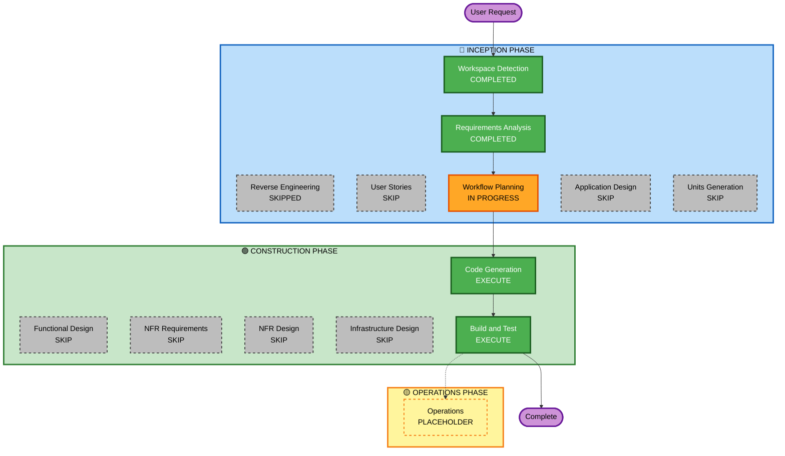

# Execution Plan — Show Uncategorized Transactions on Dashboard

## Detailed Analysis Summary

### Transformation Scope
- **Transformation Type**: Single-feature enhancement within existing component boundaries
- **Primary Changes**: Extend dashboard data pipeline to surface uncategorized transactions as pseudo-category rows in breakdown tables, pie chart, bar chart, and summary cards
- **Related Components**: model (CategoryRow, CategoryBreakdownTable), insights repository, InsightsService, transaction handler, dashboard.html template

### Change Impact Assessment
- **User-facing changes**: Yes — dashboard now shows "Uncategorized Expenses" and "Uncategorized Incomes" rows in breakdown tables, a grey slice in the pie chart, uncategorized amounts in the bar chart monthly totals, and uncategorized amounts included in Expenses/Income summary cards
- **Structural changes**: No — same clean architecture (handler → service → repository). No new components or services.
- **Data model changes**: Yes (minor) — `PeriodRanges map[string][2]string` added to `CategoryBreakdownTable`. No new field on `CategoryRow` — `CategoryID = 0` serves as the uncategorized sentinel (real categories always have ID >= 1).
- **API changes**: Yes (minor) — transaction list handler extended to parse `uncategorized=true`, `start_date`, `end_date` query params (DB filter already exists)
- **NFR impact**: No — all extensions opted out

### Component Relationships
- **Primary Component**: `internal/service/insights_service.go`
- **Upstream dependency**: `internal/repository/` (new query methods)
- **Upstream dependency**: `internal/model/` (struct extensions)
- **Downstream dependency**: `cmd/privateledger/web/templates/dashboard.html` (new row rendering)
- **Parallel change**: `internal/handler/` (transaction filter params)

### Risk Assessment
- **Risk Level**: Low
- **Rollback Complexity**: Easy — pure additive changes; removing the uncategorized rows reverts the feature
- **Testing Complexity**: Simple — data pipeline changes with clear input/output expectations

---

## Workflow Visualization

---

## Phases to Execute

### 🔵 INCEPTION PHASE
- [x] Workspace Detection — COMPLETED
- [x] Reverse Engineering — SKIPPED (prior artifacts exist and are current)
- [x] Requirements Analysis — COMPLETED
- [x] User Stories — SKIPPED (single persona, no new user workflows, no acceptance criteria complexity)
- [x] Workflow Planning — IN PROGRESS
- [x] Application Design — SKIPPED (changes are within existing component boundaries; no new services or components)
- [x] Units Generation — SKIPPED (single cohesive unit of work, no decomposition needed)

### 🟢 CONSTRUCTION PHASE
- [x] Functional Design — SKIPPED (minor struct extensions only; business logic is fully specified in requirements.md)
- [x] NFR Requirements — SKIPPED (all extensions opted out; no new NFR requirements)
- [x] NFR Design — SKIPPED (NFR Requirements skipped)
- [x] Infrastructure Design — SKIPPED (no infrastructure changes)
- [ ] Code Generation — EXECUTE (always)
- [ ] Build and Test — EXECUTE (always)

### 🟡 OPERATIONS PHASE
- [ ] Operations — PLACEHOLDER

---

## Package Change Sequence

Changes must be applied in this order due to type dependencies:

| Step | Package | Change Type | Reason |
|---|---|---|---|
| 1 | `internal/model/` | Minor (additive) | `CategoryRow` and `CategoryBreakdownTable` struct extensions; no other package can compile without these first |
| 2 | `internal/repository/` | Minor (additive) | New query methods for uncategorized monthly totals; depends on model types |
| 3 | `internal/service/` | Minor (additive) | Extend `GetCategoryBreakdownTable` and `GetMonthlySummary`; depends on repository and model |
| 4 | `internal/handler/` | Minor (additive) | Parse `uncategorized`, `start_date`, `end_date` query params; depends on service |
| 5 | `cmd/privateledger/web/templates/` | Minor (additive) | Render uncategorized rows and links in `dashboard.html`; depends on service output shape |

---

## Success Criteria
- **Primary Goal**: Uncategorized transactions are visible on the dashboard in all four locations (breakdown tables, pie chart, bar chart, summary cards)
- **Key Deliverables**:
  - "Uncategorized Expenses" row in Expense Breakdown table (clickable, links to filtered transactions)
  - "Uncategorized Incomes" row in Income Breakdown table (clickable, links to filtered transactions)
  - Uncategorized slice in "Top Expense Categories" pie chart
  - Uncategorized amounts included in "Expense Trends" bar chart monthly totals
  - Uncategorized debit amounts added to Expenses summary card
  - Uncategorized credit amounts added to Income summary card
- **Quality Gates**:
  - Existing category rows and charts are unaffected
  - No double-counting of uncategorized amounts
  - Clickable links navigate to correctly filtered transactions page
  - All periods show consistently (no $0 hiding)
