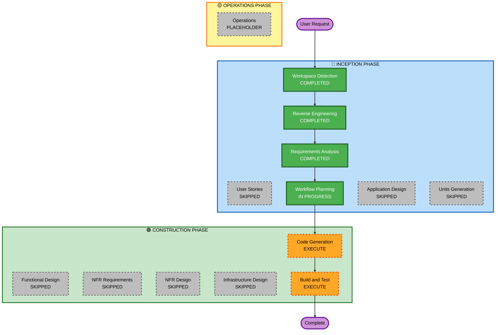

# Execution Plan — Import Revert Feature + Bug Fix

## Detailed Analysis Summary

### Transformation Scope
- **Transformation Type**: Single-feature enhancement within existing component boundaries
- **Primary Changes**: Bug fix in import batch deletion + new revert capability
- **Related Components**: TransactionRepository, ImportBatchRepository, ImportService, ImportBatchHandler, main.go, import.html, transactions.html, page_handler.go

### Change Impact Assessment
| Area | Impact | Description |
|---|---|---|
| User-facing | Yes | New Revert button in Import History; Revert banner on Transactions page |
| Structural | Minimal | ImportBatchHandler gains ImportService dependency |
| Data model | Minimal | ImportBatch gains computed `manually_categ_count` field |
| API | Yes | `DELETE /api/import/history/:id` now also deletes transactions + returns richer response |
| NFR | No | No performance, security, or scalability concerns |

### Risk Assessment
- **Risk Level**: Low
- **Rollback Complexity**: Easy — changes are additive with one behavioral change to an existing endpoint
- **Testing Complexity**: Simple — straightforward CRUD + cascade delete logic

---

## Workflow Visualization

---

## Phases to Execute

### 🔵 INCEPTION PHASE
- [x] Workspace Detection — COMPLETED
- [x] Reverse Engineering — COMPLETED
- [x] Requirements Analysis — COMPLETED
- [x] Workflow Planning — IN PROGRESS
- [ ] User Stories — SKIP (bug fix + bounded enhancement, no new personas)
- [ ] Application Design — SKIP (no new components; changes within existing boundaries)
- [ ] Units Generation — SKIP (single tightly-coupled unit of work)

### 🟢 CONSTRUCTION PHASE
- [ ] Functional Design — SKIP (business logic is unambiguous from requirements)
- [ ] NFR Requirements — SKIP (all extensions opted out; local app, no NFR concerns)
- [ ] NFR Design — SKIP (per above)
- [ ] Infrastructure Design — SKIP (no infrastructure changes)
- [ ] **Code Generation — EXECUTE** (single unit: 8 files across repository/service/handler/frontend)
- [ ] **Build and Test — EXECUTE**

### 🟡 OPERATIONS PHASE
- [ ] Operations — PLACEHOLDER

---

## Code Generation Plan (Single Unit)

Files to change, in dependency order:

| # | File | Change |
|---|---|---|
| 1 | `internal/model/import_batch.go` | Add `ManuallyCategCount int` field |
| 2 | `internal/repository/transaction_repo.go` | Add `DeleteByBatchID()` |
| 3 | `internal/repository/import_batch_repo.go` | Extend `GetByID` + `GetAll` to include manually_categ_count subquery |
| 4 | `internal/service/import_service.go` | Add `RevertResult` struct + `RevertImport()` method |
| 5 | `internal/handler/import_batch_handler.go` | Update constructor; change `DeleteBatch` to call service |
| 6 | `cmd/privateledger/main.go` | Update `NewImportBatchHandler` call |
| 7 | `internal/handler/page_handler.go` | Add `batch_id` to filterValues in `Transactions()` |
| 8 | `cmd/privateledger/web/templates/import.html` | Add Revert button + confirmation modal |
| 9 | `cmd/privateledger/web/templates/transactions.html` | Add batch revert banner |

---

## Success Criteria
- `DELETE /api/import/history/:id` deletes both the batch record and all its transactions
- Response includes `deleted_transactions` count
- Import History UI shows a Revert button; clicking it shows confirmation modal with count and manual-categorization warning
- Transactions page shows a revert banner when filtered by `?batch_id=X`
- All existing functionality (deduplication, categorization, import flow) unaffected
