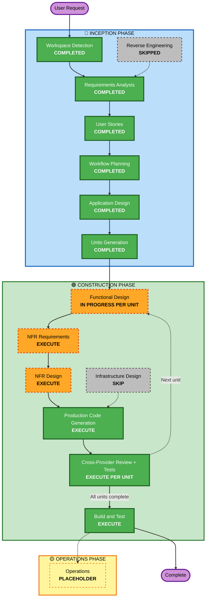

# Execution Plan — Issue #5 SIC Auto-Categorization

## Detailed Analysis Summary

### Transformation Scope

- **Transformation Type**: Multi-component brownfield feature enhancement within the existing single-binary architecture.
- **Primary Changes**:
  - Parse and store OFX/QFX `<SIC>` values.
  - Add SIC-to-category mapping persistence and APIs.
  - Add a separate SIC mapping UI with create/update/delete, download, and upload-overwrite workflows.
  - Initialize mappings from an optional local mapping file on startup.
  - Extend categorization rules so text patterns run before SIC mappings.
  - Preserve existing local databases through startup migration.
- **Related Components**:
  - `internal/parser/`
  - `internal/model/`
  - `internal/database/`
  - `internal/repository/`
  - `internal/service/`
  - `internal/handler/`
  - `cmd/privateledger/main.go`
  - `cmd/privateledger/web/templates/`
  - embedded/static assets as needed
  - tests

### Change Impact Assessment

- **User-facing changes**: Yes — new SIC mapping configuration page, transaction detail SIC visibility, mapping download/upload, and improved import categorization.
- **Structural changes**: Yes, moderate — new SIC mapping model/repository/service/handler and mapping-file import/export workflow, while preserving existing clean architecture.
- **Data model changes**: Yes — new nullable transaction SIC field and new SIC mapping table(s).
- **API changes**: Yes — new SIC mapping CRUD and import/export endpoints.
- **NFR impact**: Yes — local-only privacy, upgrade-safe migrations, idempotent mapping import, and partial property-based testing enforcement.

### Component Relationships

```text
OFX/QFX Upload
  -> parser extracts SIC
  -> model.Transaction stores SIC
  -> repository persists SIC
  -> service.Categorizer applies text pattern first, SIC mapping second
  -> import result keeps existing total_auto_categorized count

SIC Mapping Page
  -> page handler renders UI
  -> API handler handles mapping CRUD/download/upload
  -> service validates/imports/exports mappings
  -> repository stores mappings in SQLite
  -> category repository provides current category list

Startup
  -> database migration adds SIC schema
  -> mapping import service checks optional local mapping file
  -> if present, imports mappings into SQLite idempotently
  -> if absent, startup continues
```

### Risk Assessment

- **Risk Level**: Medium
- **Rollback Complexity**: Moderate — schema migration and new persisted mappings require care, but changes are additive.
- **Testing Complexity**: Moderate — parser, migration, categorization priority, import/export overwrite, and UI/API workflows need coverage.

### Module Update Strategy

- **Update Approach**: Sequential with integration checkpoints.
- **Critical Path**: Database/model changes first, then repositories/services, then handlers/UI.
- **Coordination Points**:
  - Transaction model and repository scan/insert fields must remain aligned.
  - Categorizer constructor wiring changes must be reflected in `main.go` and tests.
  - Mapping file format must be shared by upload, download, and startup import.
  - Category updates must be reflected dynamically in the mapping page.
- **Testing Checkpoints**:
  - The selected production provider implements production code only for each unit.
  - A separate provider session independently reviews the production diff and authors the unit's tests.
  - Parser/model/repository tests after UOW-1 production changes.
  - CRUD, CSV, backup, overwrite, and API tests after UOW-2 production changes.
  - Categorization, preservation, modal, concurrency, and property-based tests after UOW-3 production changes.
  - Production findings are fixed by the original production provider and re-reviewed by the independent provider.
  - Full `go test ./...` and manual UI smoke test after templates/routes.

### Independent Review and Test Ownership

| Work | Required Owner |
|---|---|
| Production implementation | Selected production-provider role |
| Independent production-code review | Review/test role in a different provider session |
| Unit/integration/property test design and test code | Review/test role in a different provider session |
| Production defect fixes | Original production provider |
| Test corrections when a test contradicts approved artifacts | Independent review provider, with rationale recorded |
| Re-review after material production fixes | Independent review provider |
| Final acceptance | User |

The production provider must not weaken or rewrite independently authored tests to make production code pass. Each unit requires PASS in `aidlc-docs/construction/<unit-name>/code-review/independent-review.md` before Code Generation completes.

## Workflow Visualization


```mermaid
flowchart TD
    Start(["User Request"])

    subgraph INCEPTION["🔵 INCEPTION PHASE"]
        WD["Workspace Detection<br/><b>COMPLETED</b>"]
        RE["Reverse Engineering<br/><b>SKIPPED</b>"]
        RA["Requirements Analysis<br/><b>COMPLETED</b>"]
        US["User Stories<br/><b>COMPLETED</b>"]
        WP["Workflow Planning<br/><b>COMPLETED</b>"]
        AD["Application Design<br/><b>COMPLETED</b>"]
        UG["Units Generation<br/><b>COMPLETED</b>"]
    end

    subgraph CONSTRUCTION["🟢 CONSTRUCTION PHASE"]
        FD["Functional Design<br/><b>IN PROGRESS PER UNIT</b>"]
        NFRA["NFR Requirements<br/><b>EXECUTE</b>"]
        NFRD["NFR Design<br/><b>EXECUTE</b>"]
        ID["Infrastructure Design<br/><b>SKIP</b>"]
        CG["Production Code Generation<br/><b>EXECUTE</b>"]
        ITR["Cross-Provider Review + Tests<br/><b>EXECUTE PER UNIT</b>"]
        BT["Build and Test<br/><b>EXECUTE</b>"]
    end

    subgraph OPERATIONS["🟡 OPERATIONS PHASE"]
        OPS["Operations<br/><b>PLACEHOLDER</b>"]
    end

    Start --> WD --> RA --> US --> WP --> AD --> UG --> FD --> NFRA --> NFRD --> CG --> ITR
    ITR -.->|Next unit| FD
    ITR -->|All units complete| BT --> End(["Complete"])
    RE -.-> RA
    ID -.-> CG
    BT -.-> OPS

    style WD fill:#4CAF50,stroke:#1B5E20,stroke-width:3px,color:#fff
    style RA fill:#4CAF50,stroke:#1B5E20,stroke-width:3px,color:#fff
    style US fill:#4CAF50,stroke:#1B5E20,stroke-width:3px,color:#fff
    style WP fill:#4CAF50,stroke:#1B5E20,stroke-width:3px,color:#fff
    style AD fill:#4CAF50,stroke:#1B5E20,stroke-width:3px,color:#fff
    style UG fill:#4CAF50,stroke:#1B5E20,stroke-width:3px,color:#fff
    style FD fill:#FFA726,stroke:#E65100,stroke-width:3px,stroke-dasharray:5 5,color:#000
    style NFRA fill:#FFA726,stroke:#E65100,stroke-width:3px,stroke-dasharray:5 5,color:#000
    style NFRD fill:#FFA726,stroke:#E65100,stroke-width:3px,stroke-dasharray:5 5,color:#000
    style CG fill:#4CAF50,stroke:#1B5E20,stroke-width:3px,color:#fff
    style ITR fill:#4CAF50,stroke:#1B5E20,stroke-width:3px,color:#fff
    style BT fill:#4CAF50,stroke:#1B5E20,stroke-width:3px,color:#fff
    style RE fill:#BDBDBD,stroke:#424242,stroke-width:2px,stroke-dasharray:5 5,color:#000
    style ID fill:#BDBDBD,stroke:#424242,stroke-width:2px,stroke-dasharray:5 5,color:#000
    style OPS fill:#FFF59D,stroke:#F57F17,stroke-width:2px,stroke-dasharray:5 5,color:#000
    style Start fill:#CE93D8,stroke:#6A1B9A,stroke-width:3px,color:#000
    style End fill:#CE93D8,stroke:#6A1B9A,stroke-width:3px,color:#000
    style INCEPTION fill:#BBDEFB,stroke:#1565C0,stroke-width:3px,color:#000
    style CONSTRUCTION fill:#C8E6C9,stroke:#2E7D32,stroke-width:3px,color:#000
    style OPERATIONS fill:#FFF59D,stroke:#F57F17,stroke-width:3px,color:#000
    linkStyle default stroke:#333,stroke-width:2px
```

## Phases to Execute

### 🔵 INCEPTION PHASE

- [x] Workspace Detection — COMPLETED
- [x] Reverse Engineering — SKIPPED
  - **Rationale**: Prior architecture artifact exists and source was inspected for this issue. Full rerun is not required for planning.
- [x] Requirements Analysis — COMPLETED
- [x] User Stories — COMPLETED
- [x] Workflow Planning — COMPLETED
- [x] Application Design — COMPLETED
  - **Rationale**: New model/repository/service/handler/page components and method boundaries need definition.
- [x] Units Generation — COMPLETED
  - **Rationale**: Work spans schema, parser, categorizer, API, UI, import/export, migration, and tests; units are needed to sequence dependencies.

### 🟢 CONSTRUCTION PHASE

- [ ] Functional Design — IN PROGRESS PER UNIT
  - **Rationale**: Categorization priority, overwrite semantics, mapping file validation, and startup import behavior need detailed business logic design.
- [ ] NFR Requirements — EXECUTE
  - **Rationale**: Partial PBT is enabled and requires framework selection/documentation; privacy and migration idempotency need explicit validation.
- [ ] NFR Design — EXECUTE
  - **Rationale**: Incorporate PBT, local-only, idempotent import, and safe overwrite patterns into the implementation design.
- [ ] Infrastructure Design — SKIP
  - **Rationale**: No cloud, deployment, networking, or external infrastructure changes; app remains local single binary + SQLite.
- [ ] Code Generation — EXECUTE
  - **Rationale**: Always required. One provider generates production code only; a different provider reviews it and authors and runs tests before the unit can complete.
- [ ] Build and Test — EXECUTE
  - **Rationale**: Always required; must run build, tests, formatting/vet, and targeted manual verification.

### 🟡 OPERATIONS PHASE

- [ ] Operations — PLACEHOLDER
  - **Rationale**: Future deployment/monitoring workflows only.

## Package Change Sequence

| Step | Area | Change Type | Dependency Reason |
|---|---|---|---|
| 1 | `internal/database`, `internal/model` | Major additive | Schema/model fields are prerequisites for persistence and services. |
| 2 | `internal/parser` | Minor additive | Needs model SIC field to populate parsed value. |
| 3 | SIC mapping repository/model | New component | Required before categorizer and API can use mappings. |
| 4 | Mapping file import/export service | New component | Shared by startup import, download, and upload overwrite. |
| 5 | `internal/service/categorizer.go` | Moderate logic change | Depends on mapping repository and loaded mappings. |
| 6 | Handlers/API routes | New endpoints | Depend on repositories/services. |
| 7 | Pages/templates/navigation | UI additions | Depend on API contract and category list behavior. |
| 8 | Independent review and tests | Mandatory per-unit gate | A different provider reviews production code and authors tests; production fixes return to the original production provider. |

## Estimated Timeline

- **Total Phases Remaining Before Coding**: 5 planning/design stages
- **Estimated Duration**: Medium; this is a moderate feature touching most application layers.

## Success Criteria

- **Primary Goal**: Imported transactions can be auto-categorized using stored SIC values after existing text patterns are evaluated.
- **Key Deliverables**:
  - SIC parsing and storage.
  - Safe startup migration for existing SQLite databases.
  - SIC mapping CRUD APIs and separate UI page.
  - Optional startup import from local mapping file.
  - Mapping file download.
  - Mapping file upload that validates fully before overwriting existing mappings.
  - Dynamic category availability in mapping UI.
  - Categorizer priority: text pattern first, SIC second; SIC mappings with empty categories intentionally leave transactions uncategorized.
  - Tests for parser, repository, categorizer, migration, import/export, and validation behavior.
- **Quality Gates**:
  - Existing imports without SIC still work.
  - Manual categorizations are never overwritten.
  - Missing mapping file does not fail startup.
  - Upload failure does not alter existing mappings.
  - Duplicate SIC mappings are rejected.
  - Empty-category SIC mappings are accepted and do not assign categories.
  - `go test ./...` passes.
  - PBT partial compliance is documented and implemented where applicable.
  - Every unit has a cross-provider independent review artifact with final status PASS.
  - No required test fails and no blocking/high independent review finding remains unresolved.
  - Production code and verification tests are authored by different providers in separate sessions.
